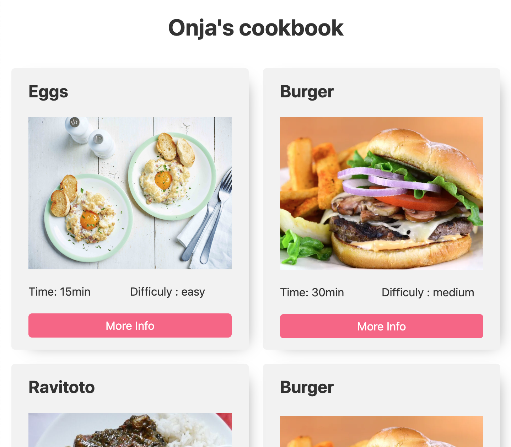
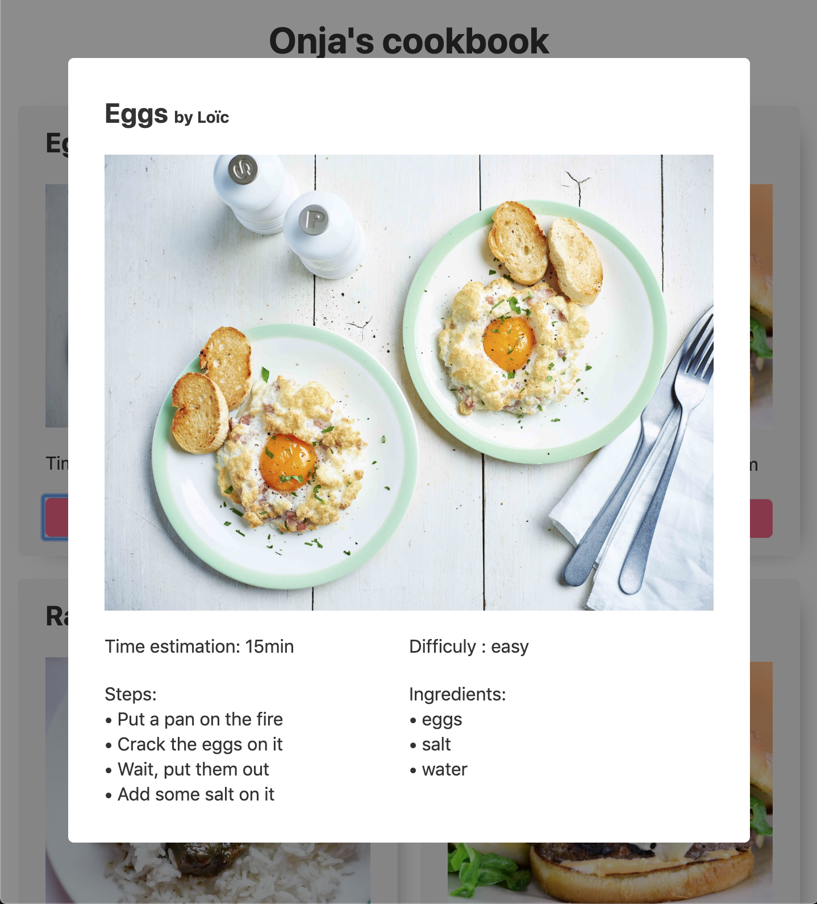
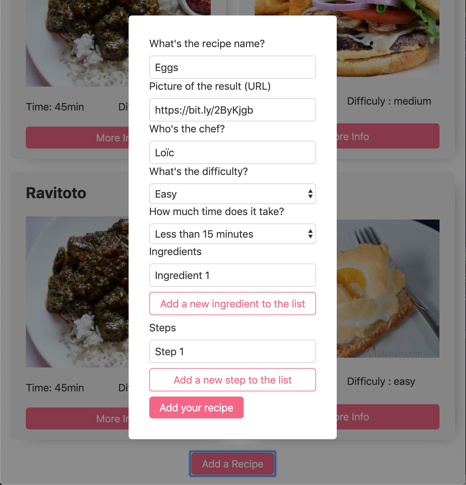

# WKP5 : Wiring up Onja Cookbook

After focussing on the form last week, it's time to list of all our delicious recipes in the DOM.

## Goal : Display a list of recipe from a predefined collection

We started the project during Friday session, but let's refresh the idea.

To store our recipes, we decided to store them into a data structure called a collection - in other words, an array of objects. It looks something like this :

```jsx
const recipes = [
	{
		title: 'Eggs',
		picture: 'https://bit.ly/2ZXyiKI',
		author: 'Loïc',
		difficulty: 'easy',
		timing: '15',
		ingredients: ['eggs', 'salt', 'water'],
		steps: [
			'Put a pan on the fire',
			'Crack the eggs on it',
			'Wait, put them out',
			'Add some salt on it',
		],
		id: 1596168482053,
	},
	{
		title: 'Burger',
		picture:
			'https://res.cloudinary.com/hv9ssmzrz/image/fetch/c_fill,f_auto,h_600,q_auto,w_800/https://s3-eu-west-1.amazonaws.com/images-ca-1-0-1-eu/tag_photos/original/1288/burger_flickr_6870386851_9fec857cec_b.jpg',
		author: 'Loïc',
		difficulty: 'medium',
		timing: '30',
		ingredients: ['buns', 'meat', 'salad'],
		steps: ['Grill the meat', 'Put it inside two buns', 'Add salad', 'And so on.'],
		id: 1596168522409,
	},
];
```

You'll notice a new attribute : the **_id._** It's a **unique** attribute that we add to each object, to identify it more easily. Here, we used a timestamp at object generation, generated by the method Date.now().

## The _renderCard_ function

First you need to create a **_renderCard_** function, that first, will loop through each object, then generate a card in html, and finally display the HTML in a list, kind of like this picture.



You don't have to stick to this design layout, as long as you show the title, image, time, difficulty and a button.

## 💡Tip

Placing the id of the recipe as a **_data-attribute_** will make our task easier after when we'll want to get the full recipe object after.

---

## Detail Modal

That's where things get interesting.

When we click on the "More Info" button, a modal will appear, and show the rest of the recipe object to us. Here's an example layout, to get you inspired.



Since you only have access to the ID when you'll click on the button, you'll have to select the corresponding object on our collection with a special array method.

## 💡Tip

First, to react to the click, you'll have to use event delegation on the button here. After that, grab the parent element (here, it's an article for me), then get the id, and finally, use the **_find_** method to get the full object.

```jsx
const handleClick = e => {
	if (e.target.matches('button.moreInfo')) {
		const parent = e.target.closest('article');
		const id = Number(parent.dataset.id);
		const recipe = recipes.find(recipe => recipe.id === id);
		openModal(recipe);
	}
};
```

## 🗺 Go Further

So you're done all that? Congratulations! Let's go further then 💪

Remember the form from last week? Let's add a "Add recipe" button on the bottom of the page, and let's put that form into a modal! Like that :



Let's try to link this form to our recipes list. Each time we will submit the form with new data, this recipe should go on the recipes list, and then we should call the renderCard function again, and see the new recipe in the list. Pretty neat ✨

## 💡Tip

You'll need event delegation for _every_ event in the modal, because none of the html will be present on the DOM at loading time. Same things for the grabbed element. You'll need to grab them straight away in the event handler.

🚨Don't forget to comment your code, indent it correctly, and write your _code plan_ as comments before starting to code! 🚨

## I think that's more than enough for this time! Good luck everyone!
